<div align="center">

# 🕒 Desk Tracking

**Zeiterfassung für Windows.** Kommen drücken, arbeiten, Gehen drücken —
den Rest rechnet die App.

Pausen abziehen, Zeiten auf Projekte buchen, am Monatsende eine Aufstellung
als CSV oder PDF. Dazu ein Kalender mit Terminen, ein Dashboard mit Kennzahlen
und ein Mini-Bedienfeld für den Schnellzugriff.

[Herunterladen](https://github.com/CaroWebAgentur/desk-tracking/releases/latest) ·
[Installieren](#installieren) ·
[So arbeitest du damit](#so-arbeitest-du-damit) ·
[Wo deine Zeiten liegen](#wo-deine-zeiten-gespeichert-sind)

</div>

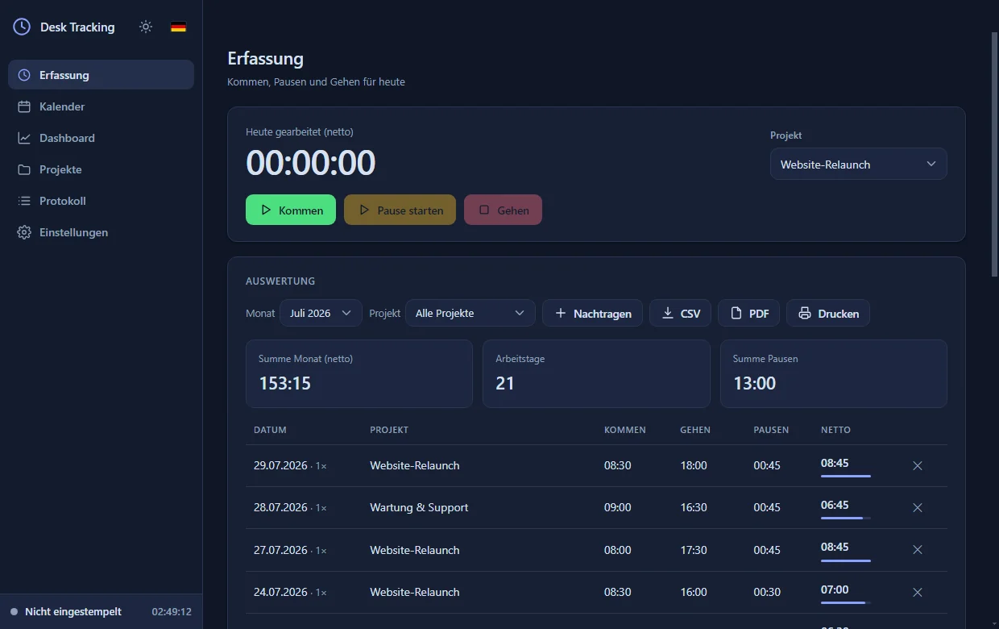

Alles bleibt auf deinem Rechner: keine Cloud, kein Konto, keine Anmeldung.
Die Oberfläche gibt es in Hell und Dunkel und in sechs Sprachen.

---

## Was die App kann

| | |
|---|---|
| ⏱️ **Stempeln** | Kommen, Pause, Gehen. Mehrere Blöcke pro Tag, jeder mit eigenem Projekt. |
| 🌙 **Nachtschichten** | Eine Schicht über Mitternacht ist **ein** Eintrag, nicht zwei. |
| 📁 **Projekte** | Stundensatz je Projekt, fertige Projekte abschließen statt löschen. |
| 📅 **Kalender** | Monatsübersicht mit Auslastung, Terminen und Notizen. |
| 🔔 **Erinnerungen** | Windows meldet anstehende Termine, auch bei minimiertem Fenster. |
| 📊 **Dashboard** | Stunden und Umsatz je Projekt, Soll/Ist-Saldo, Monatsvergleich. |
| 📄 **Export** | CSV, PDF und Drucken — pro Monat oder pro Projekt. |
| ⌨️ **Schnellzugriff** | Tastenkürzel und ein Mini-Bedienfeld für die Ecke des Bildschirms. |
| 🌍 **Sechs Sprachen** | Deutsch, Englisch, Französisch, Spanisch, Japanisch, Chinesisch. |
| 🔄 **Updates** | Neue Versionen laden sich selbst — deine Zeiten bleiben unberührt. |

---

## Installieren

Lade die neueste `Desk-Tracking-Setup-<version>.exe` von der
**[Releases-Seite](https://github.com/CaroWebAgentur/desk-tracking/releases/latest)**
und führe sie aus.

Die Installation braucht **keine Administratorrechte**. Sie legt Verknüpfungen auf dem
Desktop und im Startmenü an und startet die App danach sofort.

### „Der Computer wurde durch Windows geschützt"

Beim ersten Start des Installers legt Windows einen blauen Bildschirm davor. Klicke auf
*Weitere Informationen* und dann auf *Trotzdem ausführen* — danach installiert sich die
App normal.

Diese Meldung heißt nicht, dass an der Datei etwas faul ist. Sie kommt von SmartScreen,
und SmartScreen kennt nur zwei Dinge: eine gültige Herausgeber-Signatur oder die Anzahl
der Leute, die dieses Programm schon heruntergeladen haben. Eine Signatur bedeutet ein
Zertifikat für ein paar hundert Euro im Jahr, und die Downloadzahlen einer App, die im
eigenen Betrieb läuft, erreichen die nötige Schwelle nie. Also warnt Windows — bei jedem
Programm ohne Zertifikat, unabhängig davon, was es tut.

Was du stattdessen prüfen kannst:

- Lade die Datei nur von der Releases-Seite dieses Projekts. Zu jedem Release gehört eine
  `latest.yml` mit der Prüfsumme der `.exe`.
- Der Quellcode liegt vollständig offen. Was die App tut, ist nachlesbar.
- Die App verbindet sich mit genau einer Adresse: GitHub, um nach Updates zu sehen. Deine
  Zeiten verlassen den Rechner nicht.

**Bei automatischen Updates erscheint die Meldung nicht.** Die App lädt und startet den
Installer selbst; SmartScreen prüft nur Dateien, die über einen Browser hereinkommen.

---

## So arbeitest du damit

Links steht die Navigation, unten links siehst du jederzeit, ob die Uhr läuft — egal in
welcher Ansicht du bist.

In der **Erfassung** wählst du das Projekt und drückst **Kommen**. Die Uhr läuft mit, du
siehst, wie lange du heute schon gearbeitet hast. Für eine Mittagspause drückst du
**Pause starten**, danach dasselbe Feld als **Pause beenden** — die Zeit wird automatisch
abgezogen. Am Ende **Gehen**.

Darunter steht die Auswertung des Monats: jeder Tag mit Kommen, Gehen, Pausen und
Netto-Zeit, oben die Summen.

Du kannst mehrmals am Tag ein- und ausstempeln, etwa vormittags für einen Kunden und
abends für einen anderen. Jeder dieser Abschnitte ist ein eigener **Block**.

### Etwas vergessen oder falsch gestempelt?

Klicke in der Auswertung auf die Tageszeile. Das Tagesfenster zeigt alle Blöcke des Tages:

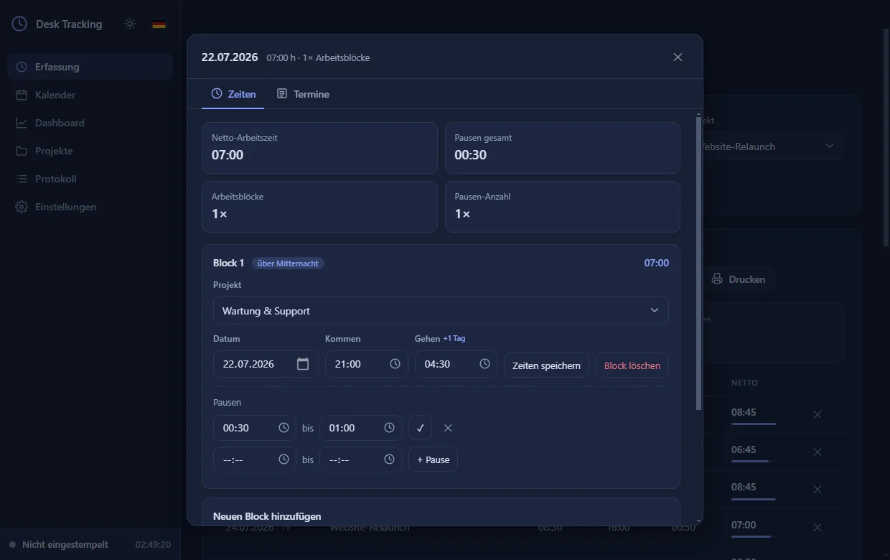

Dort lassen sich Datum, Kommen, Gehen, Projekt und Pausen jedes Blocks ändern, Blöcke
hinzufügen oder löschen. Über das Datumsfeld verschiebst du einen Block auf einen anderen
Tag, falls du dich vertan hast.

Für Zeiten, die du gar nicht gestempelt hast, gibt es **Nachtragen**.

### Nachtschichten über Mitternacht

Eine Schicht, die über Mitternacht läuft, ist **ein** Eintrag — du musst sie nicht in
23:59 und 00:00 zerlegen. Trag einfach `21:30` als Kommen und `05:15` als Gehen ein:
Liegt das Gehen vor dem Kommen, gehört es automatisch zum Folgetag.

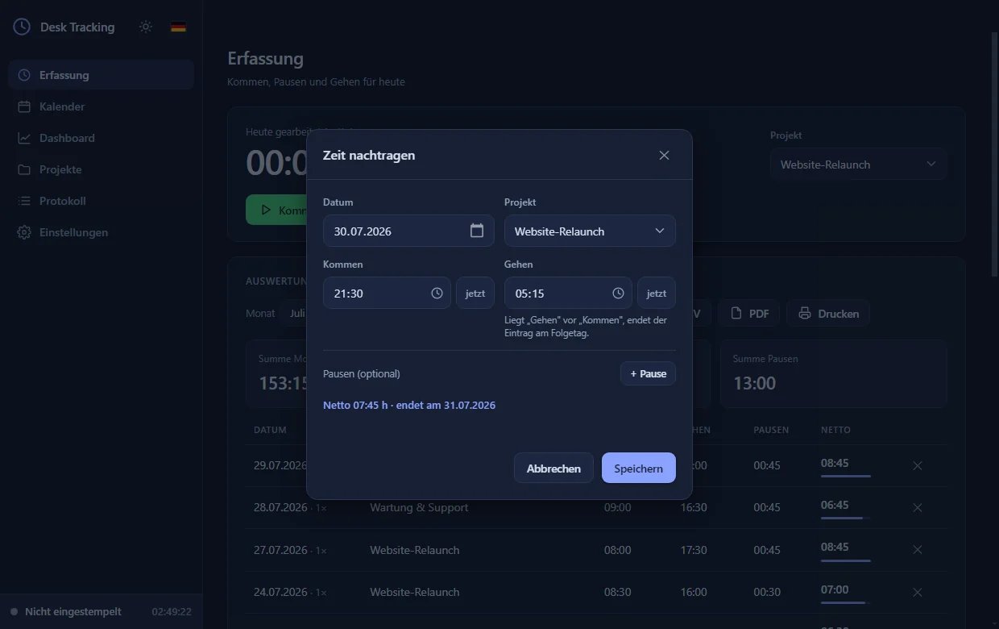

Das Formular zeigt dir laufend, was gespeichert wird, damit ein Vertipper nicht unbemerkt
einen 23-Stunden-Eintrag erzeugt. Pausen funktionieren genauso: Eine Pause um `01:00`
wird der Nacht zugeordnet, eine um `23:00` noch dem Vortag. In den Tabellen erkennst du
solche Zeiten am kleinen **+1**.

Der Eintrag zählt zu dem Tag, an dem die Schicht **beginnt** — eine Nacht vom 31. Juli auf
den 1. August landet also vollständig im Juli.

---

## Kalender und Termine

Der Kalender zeigt den ganzen Monat auf einem Blatt. Tage mit erfasster Zeit sind
eingefärbt — je kräftiger, desto näher am Tagessoll — und tragen die Netto-Stunden oben
rechts. Termine erscheinen als Chips im jeweiligen Tag.

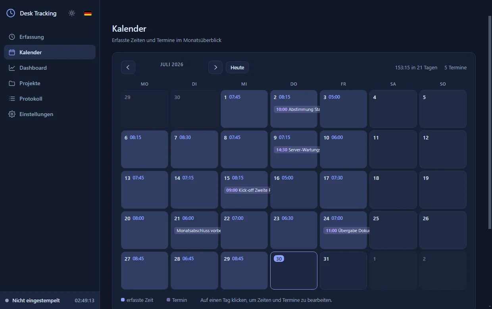

Ein Klick auf einen Tag öffnet dasselbe Fenster wie in der Auswertung, jetzt mit zwei
Reitern: **Zeiten** zum Bearbeiten der Blöcke und **Termine** für Verabredungen und
Notizen.

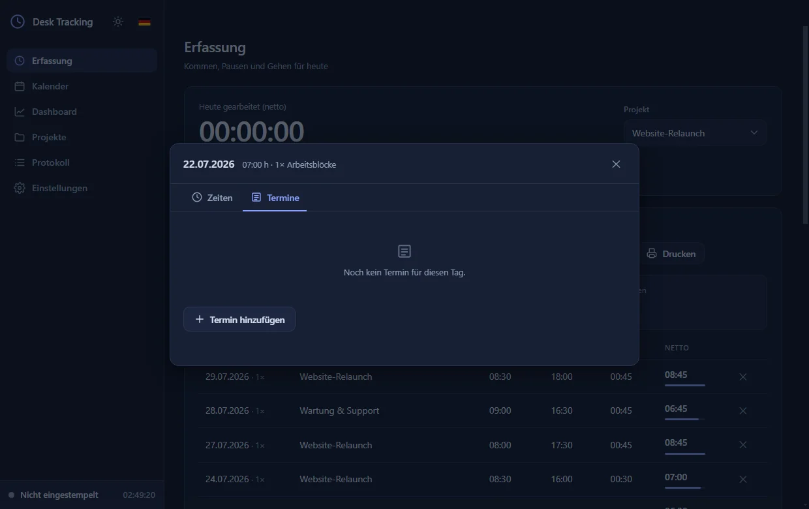

Ein Termin braucht nur einen Titel; Uhrzeit und Notiz sind optional. Ohne Uhrzeit gilt er
als ganztägig — praktisch für Erinnerungen wie „Monatsabschluss". Die Notiz ist ein freies
Textfeld und behält Zeilenumbrüche.

Jeder Termin lässt sich einem **Projekt** zuordnen; ohne Zuordnung gilt „Sonstiges". Das
steuert auch den Export: Filterst du die Auswertung auf ein Projekt, erscheinen nur seine
Termine. Löschst du ein Projekt, fallen seine Termine auf „Sonstiges" zurück — sie gehen
nicht verloren.

**Erinnerungen** meldet Windows, sobald ein Termin ansteht — mit Titel, Uhrzeit, Projekt
und der ersten Notizzeile. Die Vorlaufzeit stellst du in den Einstellungen ein (Standard
10 Minuten vorher). Ein Klick auf die Meldung öffnet den passenden Tag. Das funktioniert,
solange die App läuft — auch minimiert.

---

## Projekte und Abrechnung

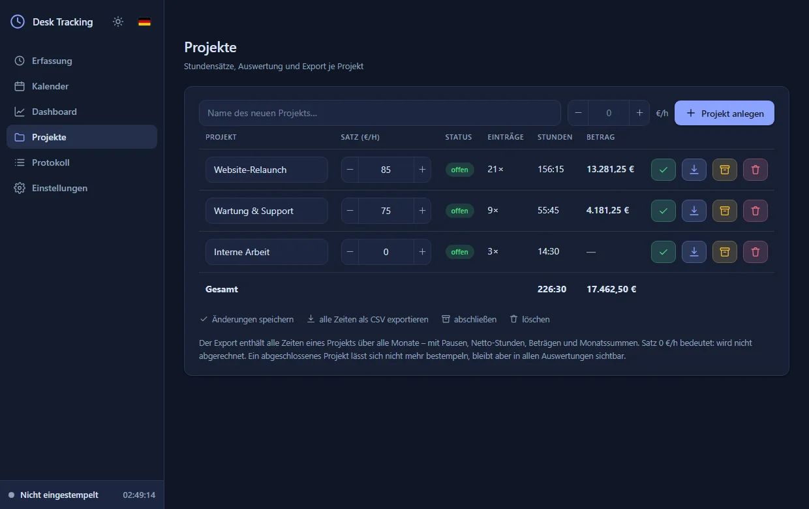

Jedes Projekt hat einen Stundensatz. Trägst du dort `0` ein, gilt das Projekt als nicht
abgerechnet — es taucht in den Stunden auf, aber ohne Betrag.

Rechts in jeder Zeile stehen vier Aktionen, farblich getrennt, damit man Speichern und
Löschen nicht verwechselt:

| Farbe | Aktion |
|---|---|
| 🟢 grün | Name und Stundensatz speichern |
| 🔵 blau | Alle Zeiten dieses Projekts als CSV exportieren |
| 🟡 gelb | Projekt abschließen — verschwindet aus der Auswahl, bleibt in den Auswertungen |
| 🔴 rot | Projekt löschen |

Ein Projekt mit Zeiten lässt sich nicht einfach löschen: Die App fragt, auf welches
Projekt die Zeiten umgebucht werden sollen. Erfasste Arbeit verschwindet nie unbemerkt.

---

## Auswerten und exportieren

Das Dashboard ergänzt die Monatstabelle um Kennzahlen: Stunden und Umsatz pro Projekt,
Soll/Ist-Saldo und den Vergleich mit den Vormonaten.

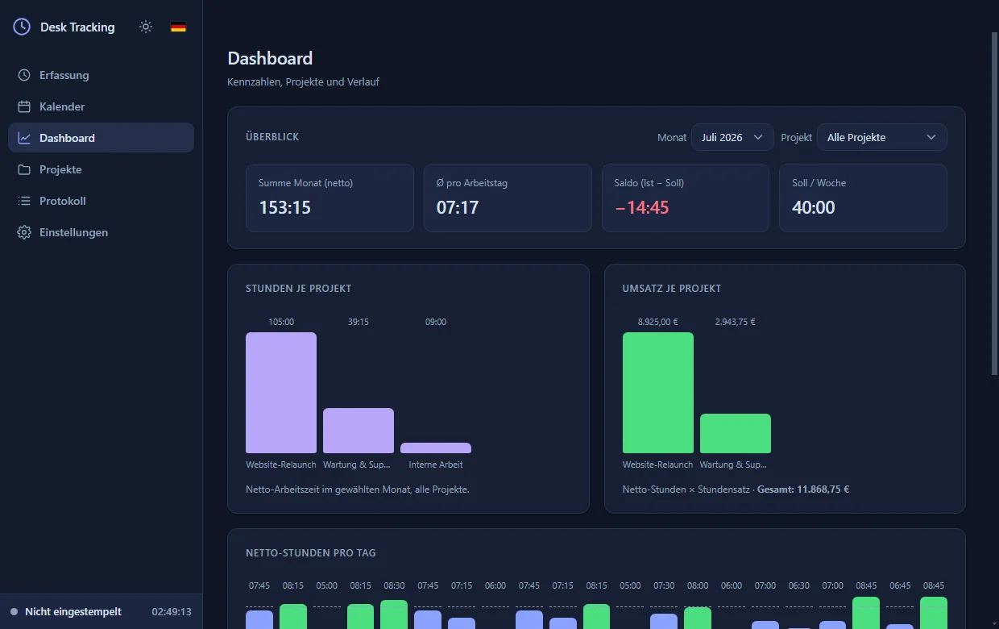

Zum Exportieren gibt es vier Wege:

| Was | Wo | Inhalt |
|-----|-----|--------|
| **CSV** | Auswertung | Der gewählte Monat: jeder Block einzeln, darunter die Tagessummen und ein Abschnitt mit allen **Terminen** des Monats |
| **PDF** | Auswertung | Dieselbe Tabelle als PDF, mit eigener Termin-Tabelle darunter |
| **Drucken** | Auswertung | Über einen angeschlossenen Drucker, gleiches Layout |
| **Export** (⭳ in der Projektzeile) | Projekte | Ein einzelnes Projekt komplett: alle Monate, mit Pausen, Beträgen, Monatssummen und den Terminen dieses Projekts |

Hast du in der Auswertung ein Projekt gewählt, enthält der Export nur dessen Zeiten **und
nur dessen Termine**.

Die CSV-Dateien öffnen sich in Excel mit korrekten Umlauten; Beträge und Stunden stehen
mit deutschem Komma drin und lassen sich direkt weiterrechnen.

---

## Hell oder dunkel

Die Sonne oben links in der Seitenleiste wechselt das Design. Die Auswahl wird gespeichert
und beim nächsten Start wiederhergestellt.

<table>
<tr>
<td width="50%">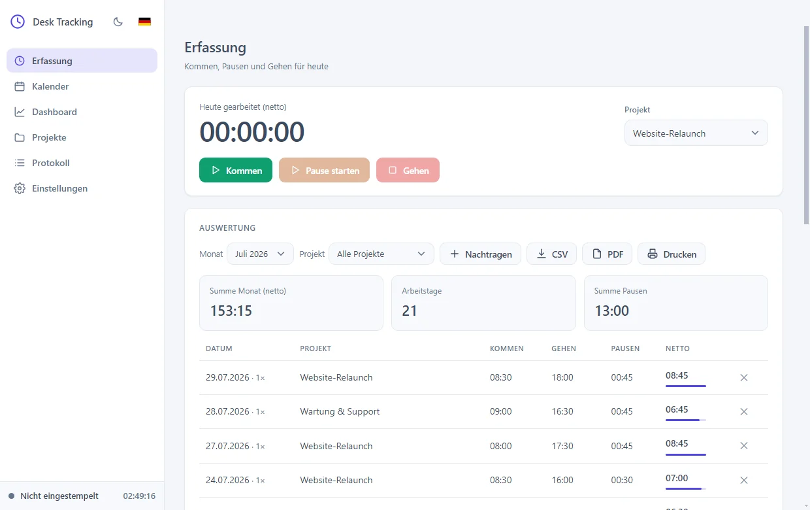</td>
<td width="50%">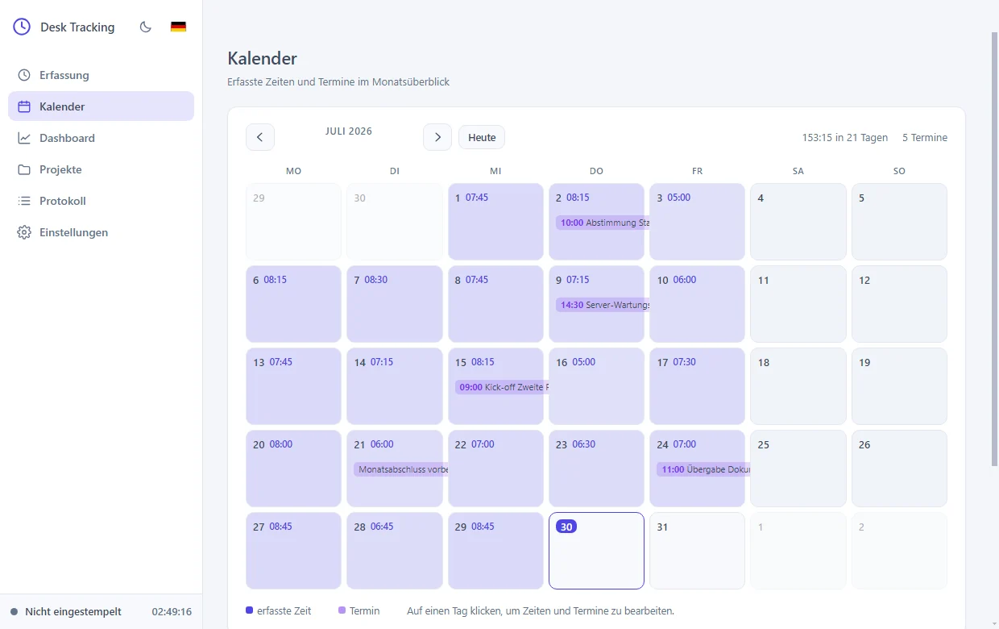</td>
</tr>
<tr>
<td align="center"><sub><b>Erfassung, hell</b></sub></td>
<td align="center"><sub><b>Kalender, hell</b></sub></td>
</tr>
<tr>
<td width="50%">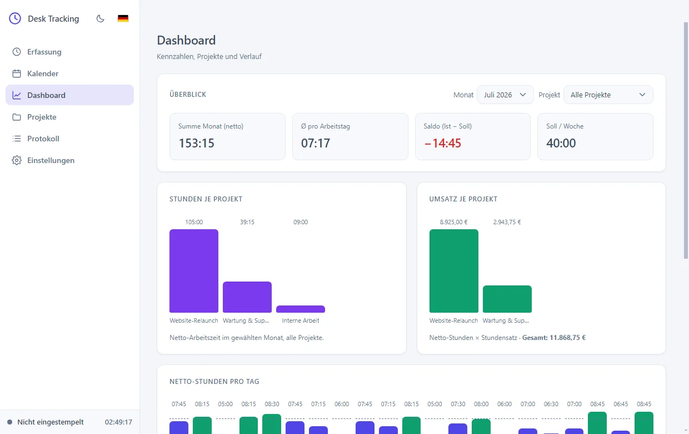</td>
<td width="50%">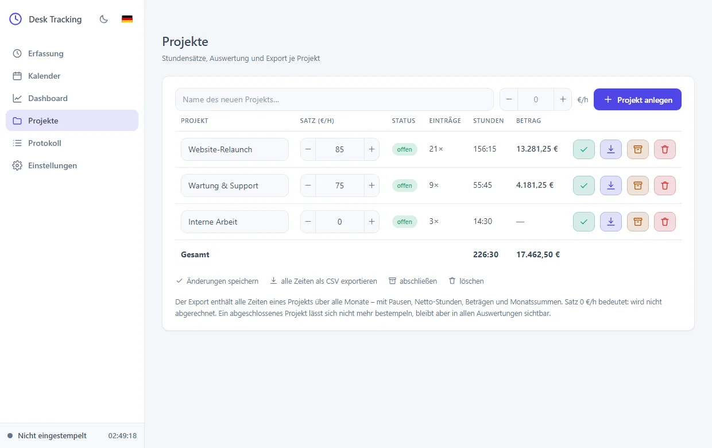</td>
</tr>
<tr>
<td align="center"><sub><b>Dashboard, hell</b></sub></td>
<td align="center"><sub><b>Projekte, hell</b></sub></td>
</tr>
</table>

---

## Sprache und Datumsformat

Neben der Sonne sitzt eine Flagge. Sie wechselt die Sprache — die Umstellung greift sofort
in allen Ansichten, auch im Mini-Bedienfeld, und gilt beim nächsten Start weiter.

<table>
<tr>
<td width="50%">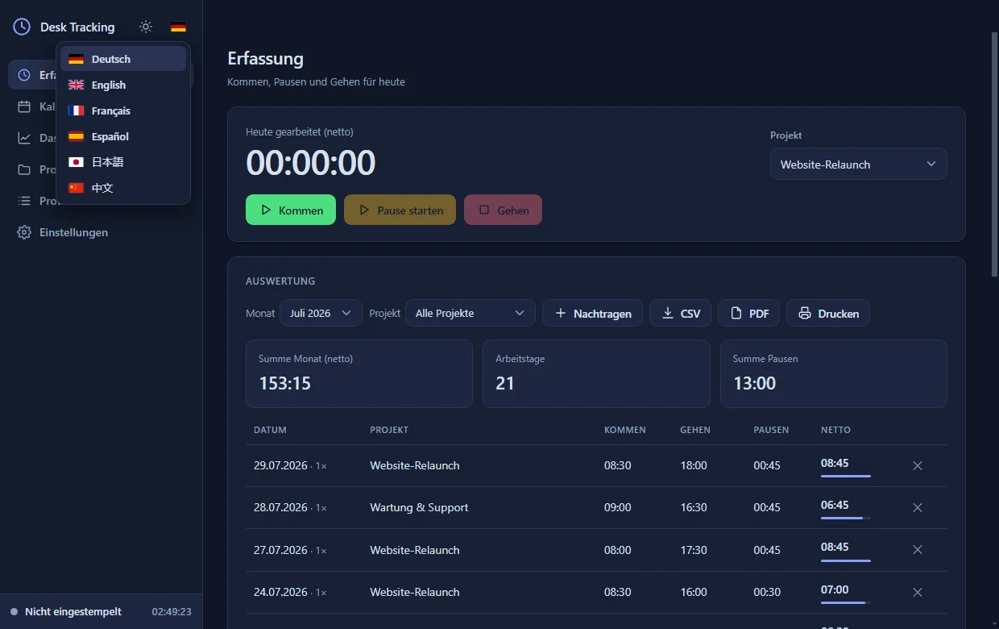</td>
<td width="50%">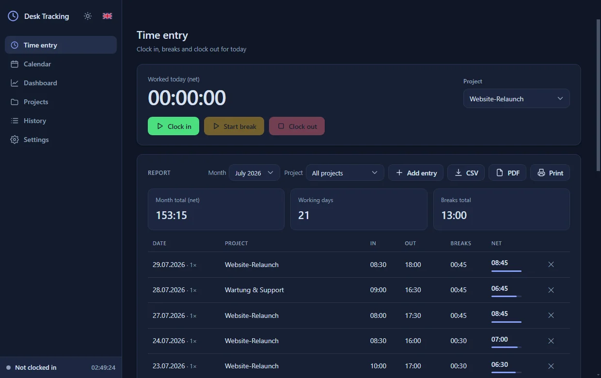</td>
</tr>
<tr>
<td align="center"><sub><b>Sechs Sprachen zur Wahl</b></sub></td>
<td align="center"><sub><b>Dieselbe Ansicht auf Englisch</b></sub></td>
</tr>
</table>

Wie ein Datum aussieht, legst du unter *Einstellungen → Datum und Sprache* fest:

| Format | Beispiel |
|--------|----------|
| `dd.MM.yyyy` | 09.03.2026 |
| `yyyy-MM-dd` | 2026-03-09 |
| `dd/MM/yyyy` | 09/03/2026 |
| `MM/dd/yyyy` | 03/09/2026 |
| `d. MMMM yyyy` | 9. März 2026 |
| `EEE dd.MM.yyyy` | Mo 09.03.2026 |
| `EEE, d. MMMM yyyy` | Mo, 9. März 2026 |

Der Schalter **Jahr abkürzen** macht aus `2026` ein `26` — damit die Liste kurz bleibt,
statt jedes Format zweimal anzubieten. Ein Beispielfeld zeigt vor dem Speichern, wie es
aussehen wird. Das gewählte Format gilt überall: Auswertung, Kalender, Termine und in
allen Exporten. Monats- und Wochentagsnamen erscheinen in der gewählten Sprache.

---

## Schnell hin und her

Zwei Wege, um beim Arbeiten nicht ständig das Fenster zu suchen — beide unter
**Einstellungen** einzuschalten:

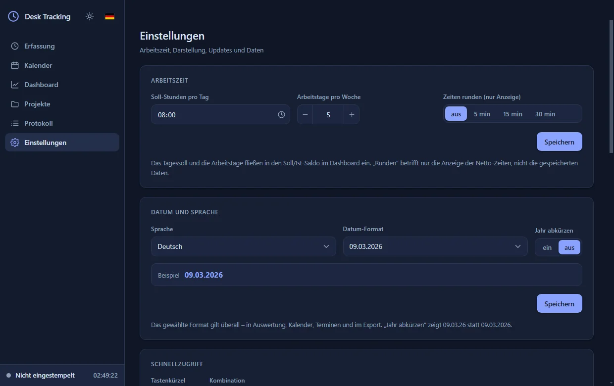

Das **Tastenkürzel** holt Desk Tracking aus jedem Programm nach vorn, ein zweiter Druck
legt es wieder ab. Voreingestellt ist `Strg + Umschalt + T` — bewusst mit Umschalt, damit
Browsern nicht das „neuer Tab" weggenommen wird. Zum Ändern klickst du in das Feld und
drückst die gewünschte Kombination. Kombinationen, die Windows selbst braucht (`Alt+F4`,
`Alt+Tab`, `Strg+Alt+Entf`), lehnt die App ab. Ist ein Kürzel von einem anderen Programm
belegt, sagt sie das und behält das alte.

Das **Mini-Bedienfeld** erscheint, sobald du das Fenster minimierst: ein kleines Feld über
allen anderen Fenstern, unten rechts oder links. Darin siehst du Status und heutige Zeit
und kannst stempeln, Pause machen und das Projekt wechseln — ohne die App zu öffnen.
Verschieben kannst du es am oberen Rand. Über den Pfeil rechts oben holst du das große
Fenster zurück.

Beide Fenster bleiben synchron: Was du im Mini-Feld stempelst, steht sofort auch in der
Auswertung, und umgekehrt.

---

## Wo deine Zeiten gespeichert sind

In einer einzigen Datei:

```
Dokumente\Desk Tracking\times.json
```

Diesen Ordner öffnest du direkt aus der App über **Einstellungen → Datenspeicher →
Ordner öffnen**. Eine Kopie dieser Datei ist ein vollständiges Backup — sie enthält
Zeiten, Projekte, Einstellungen und das Änderungsprotokoll.

> **Kommst du von der „Stempeluhr"?** Bis Version 1.6 hieß das Programm so und speicherte
> unter `Dokumente\Stempeluhr`. Beim ersten Start übernimmt Desk Tracking deine Zeiten von
> dort — es **kopiert** sie, der alte Ordner bleibt unangetastet liegen. Im neuen Ordner
> findest du zusätzlich eine unveränderte Kopie als `times.uebernommen-<Datum>.json`.
> Liegt am neuen Ort bereits eine `times.json`, passiert nichts: vorhandene Daten werden
> nie überschrieben.

Die Datei liegt bewusst nicht im Programmordner. Der Windows-Installer leert diesen Ordner
bei jedem Update vollständig; alles, was dort liegt, wäre danach weg. Unter „Dokumente"
überstehen deine Zeiten Updates und selbst eine Deinstallation.

Zusätzlich schützt die App die Daten von sich aus:

- Bei jedem Start legt sie eine Sicherung `times.backup-JJJJ-MM-TT.json` an; die letzten
  acht bleiben liegen. Vor jedem Update kommt eine weitere dazu.
- Beim Speichern schreibt sie erst eine Nebendatei und benennt sie dann um. Stürzt der
  Rechner mitten im Speichern ab, bleibt die alte Datei unbeschädigt.
- Lässt sich die Datei nicht lesen, weil sie beschädigt ist, **startet die App bewusst
  nicht**. Sie sagt dir, was los ist, und öffnet den Ordner mit den Sicherungen. So kann
  sie deine Zeiten nicht versehentlich mit einem leeren Stand überschreiben.
- Die App läuft nur einmal gleichzeitig. Zwei offene Fenster würden sich sonst gegenseitig
  überschreiben.

Ist etwas kaputt gegangen: Benenne eine der `times.backup-….json` in `times.json` um, und
der Stand von damals ist wieder da.

---

## Updates

Die App prüft bei jedem Start, ob es eine neuere Version gibt, lädt sie im Hintergrund und
installiert sie, sobald du das Programm schließt. Du musst nichts weiter tun.

Unter *Einstellungen → Updates* siehst du die installierte Version, kannst von Hand nach
Updates suchen — und unter **„Was ist neu?"** nachlesen, was sich geändert hat:

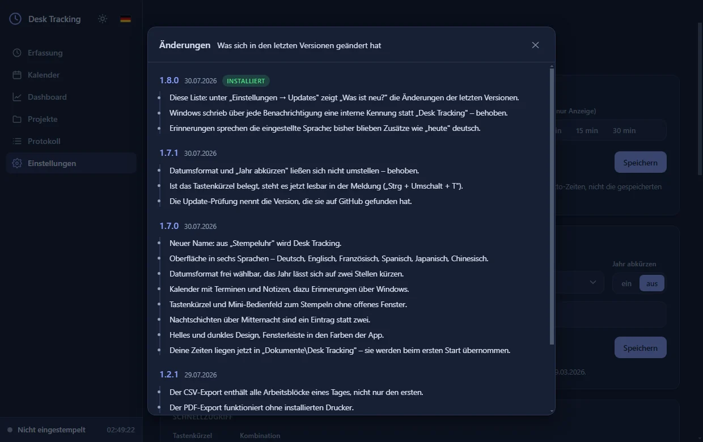

Deine erfassten Zeiten werden bei einem Update nicht angefasst; sie liegen außerhalb des
Programmordners.

---

## Für Entwickler

```powershell
npm install
npm start        # App im Entwicklungsmodus starten
npm test         # Logiktests der Datenschicht und Prüfung der Übersetzungen
```

Electron mit `contextIsolation`, ohne `nodeIntegration`; die Oberfläche spricht
ausschließlich über eine schmale Bridge in `preload.js` mit dem Hauptprozess. Gespeichert
wird in JSON — bewusst keine native Datenbank, damit der Build ohne Compiler-Toolchain
auskommt.

| Datei | Zweck |
|-------|-------|
| `main.js` | Hauptprozess: Fenster, IPC, Datenordner, Sicherungen, Updater |
| `preload.js` | Bridge zwischen Oberfläche und Hauptprozess |
| `store.js` | Datenschicht: Stempel- und Editier-Logik, Projekte, Protokoll |
| `src/` | Oberfläche (`index.html`, `styles.css`, `renderer.js`) |
| `src/i18n.js` | Alle Texte in sechs Sprachen, Monats- und Wochentagsnamen |
| `src/changelog.js` | Einträge für „Was ist neu?" |
| `src/mini.*` | Mini-Bedienfeld als eigenes Fenster (eigene HTML/CSS/JS, gleicher preload) |
| `build/installer.nsh` | Installer-Hook, der Altdaten aus dem Programmordner rettet |
| `test-store.js` | Tests der Datenschicht (`npm test`) |
| `test-i18n.js` | Prüft die Übersetzungen auf Lücken, Duplikate und feste Texte |

Beim Ändern der Datenschicht gilt: `store.js` kennt kein Electron und ist damit ohne GUI
testbar. `STEMPEL_DATA_DIR` überschreibt den Speicherort, etwa für Testläufe.

Neue Oberflächentexte gehören nach `src/i18n.js` und werden über `data-i18n` im HTML oder
`t('schlüssel')` im Skript eingebunden — nie als fester Text. Genau das prüft
`test-i18n.js`: fehlt ein Schlüssel in einer Sprache, ist einer doppelt vergeben oder
steht ein deutscher Satz fest im Code, schlägt der Test fehl.

---

## Gut zu wissen

Es kann immer nur eine Sitzung gleichzeitig laufen; beim „Gehen" wird eine noch offene
Pause automatisch mitbeendet. Nur der heutige Tag kann eine laufende Sitzung haben —
ältere Einträge lassen sich nicht wieder öffnen, sonst würde die Arbeitszeit ins
Unendliche weiterlaufen.

Die Rundung in den Einstellungen betrifft nur die Anzeige. Gespeichert bleiben immer die
exakten Zeiten, sodass du die Rundung jederzeit ändern kannst, ohne Daten zu verlieren.

Die Screenshots in dieser Datei zeigen Beispieldaten, keine echten Projekte.

---

<div align="center">
<br />

**Entwickelt von [Caro WebAgentur](https://github.com/CaroWebAgentur)**

Webdesign und Individualsoftware aus einer Hand.

<sub>MIT-Lizenz · © 2026 Caro WebAgentur</sub>

</div>
